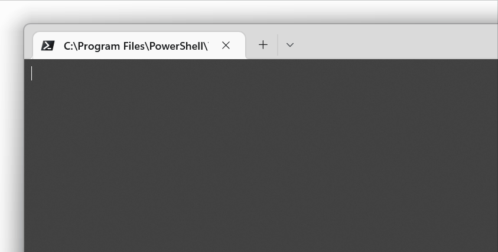

## **TermProc**  

The purpose of the code in this repository is both to distinguish between Conhost and Windows Terminal processes and to determine which terminal instance is connected to the current console process. Third-party terminal apps are not supported.  
The source files are transcriptions of pretty much the same core code in different programming languages.  
 
### **Minimum requirements to compile/run the code:**  

| **File** | **Requirement** |
| :--- | :--- |
| `*.bat` | *Windows PowerShell 2* |
| `*.c` | *C99* |
| `*.cpp` | *C++20* |
| `*.cs` | *.NET Framework 4.5* |
| `*.ps1` | *Windows PowerShell 2* |
| `*.vb` | *.NET Framework 4.5* |

 

### **Background:**  
A few years ago Microsoft began to develop a new terminal application - [Windows Terminal](https://github.com/microsoft/terminal). The installation is available for Windows 10, and Windows 11 already ships with it. By an update in October '22 Microsoft turned it into the default terminal app on Windows 11.  
As of now, Windows Terminal coexists with the good old Conhost. Users are able to choose which is taken as their default terminal app.

In the past, it has been easy to figure out which terminal process is connected to the shell/console application. Behind the scenes it was always Conhost and thus, Microsoft made the Windows API reporting the process which spawned the conhost process as the terminal process, and reporting the window of the shell application as the console window. While all this is technically incorrect, it is quite comfortable at the same time.  
However, no such convenience functionality is implemented for the Windows Terminal. And if Windows Terminal is set as the default terminal, we cannot infer from the process tree which terminal process is communicating with our shell process.  

Using Process Explorer I observed that the Windows Terminal process has a handle to the shell process open. Assuming that this is always the case I tried to write a piece of code that enumerates all open handles searching for the right process handle. This requires to involve some undocumented API. I left a couple of comments in the code that roughly explain how this all works.  

In each file is also a piece of unrelated code that fades the window out and in again. I found it an impressive way of proving that the right process had been found.  

